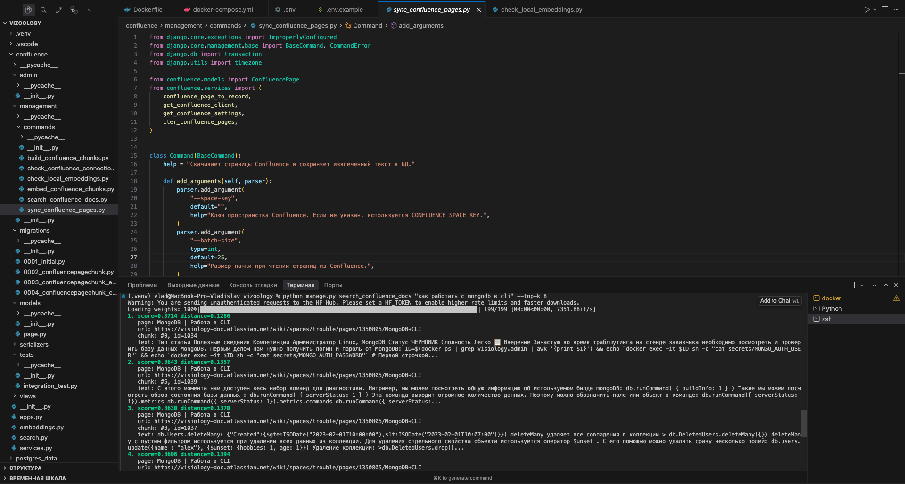

## Vizoology

Проект для поиска ответов по документации Visiology из Confluence. Сейчас реализован RAG-фундамент: страницы Confluence скачиваются в БД, текст делится на чанки, для чанков генерируются локальные embeddings и сохраняются в Postgres/pgvector.

Пример релевантной выдачи поиска:



### Что уже умеет

- Подключается к Confluence через Atlassian API.
- Синхронизирует пространства документации, например `3v16` и ViHelp (`trouble`).
- Извлекает plain text из страниц.
- Делит текст на логические чанки.
- Генерирует embeddings локальной моделью `intfloat/multilingual-e5-small`.
- Ищет ближайшие чанки через `pgvector` и cosine distance.

### Быстрый старт

1. Скопировать `.env.example` в `.env` и заполнить Confluence-доступы:

```env
CONFLUENCE_BASE_URL=https://your-site.atlassian.net/wiki
CONFLUENCE_SPACE_KEY=3v16
CONFLUENCE_USERNAME=you@example.com
CONFLUENCE_API_TOKEN=your-token
```

2. Запустить Postgres с pgvector:

```bash
docker compose up -d db
```

3. Применить миграции:

```bash
.venv/bin/python manage.py migrate
```

### Индексация документации

Для основного пространства из `.env`:

```bash
.venv/bin/python manage.py sync_confluence_pages
.venv/bin/python manage.py build_confluence_chunks
.venv/bin/python manage.py embed_confluence_chunks
```

Для ViHelp:

```bash
.venv/bin/python manage.py sync_confluence_pages --space-key trouble --batch-size 10 --retries 3
.venv/bin/python manage.py build_confluence_chunks --space-key trouble
.venv/bin/python manage.py embed_confluence_chunks
```

### Поиск

```bash
.venv/bin/python manage.py search_confluence_docs "как работать с mongodb в cli" --top-k 5
```

Команда вернёт ближайшие чанки, название страницы, ссылку на Confluence и score релевантности.

### Полезные проверки

```bash
.venv/bin/python manage.py check_confluence_connection
.venv/bin/python manage.py check_local_embeddings --limit 1
.venv/bin/python manage.py test confluence
```